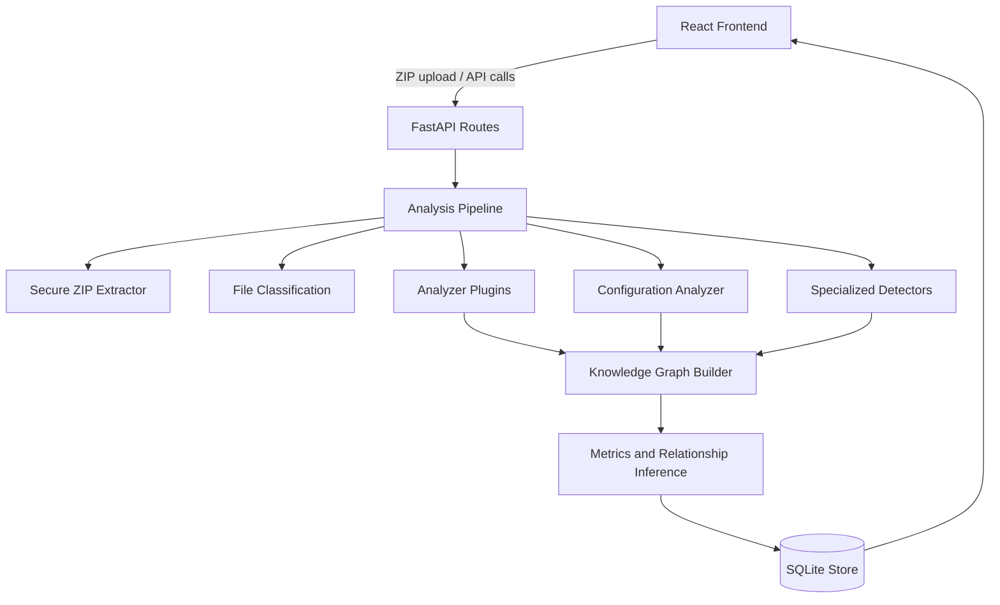

# Architecture

## System Diagram



## Components

- `backend/api`: FastAPI endpoints for upload, retrieval, graph, tree, metrics, search, compare, and Mermaid export.
- `backend/analyzers`: Plugin-style language analyzers with a shared `BaseAnalyzer` contract.
- `backend/parsers`: Tree-sitter traversal helpers.
- `backend/utils/extractor.py`: ZIP validation, integrity checks, path sanitization, and temp cleanup.
- `backend/utils/detector.py`: Config parsing and technology signature detection.
- `backend/utils/relationships.py`: Graph construction, circular dependency detection, dead code detection, and Mermaid export.
- `frontend/src`: React pages and components for upload, graph exploration, metrics, search, and repository browsing.

## Data Flow

1. User uploads a ZIP through the React UI.
2. FastAPI validates size and extension.
3. Extractor validates ZIP integrity and path safety in an isolated temp directory.
4. Pipeline classifies files and dispatches analyzers.
5. Config analyzer extracts dependencies and infrastructure hints.
6. Detectors identify frameworks, databases, cloud, containers, AI/ML, APIs, and queues.
7. Relationship builder creates nodes and edges.
8. Metrics aggregate LOC, complexity, dead code, circular dependencies, and language counts.
9. SQLite stores the full JSON analysis.
10. Frontend retrieves and visualizes graph, tree, search results, and metrics.

## Database Schema

```sql
CREATE TABLE analyses (
  id TEXT PRIMARY KEY,
  repository_name TEXT NOT NULL,
  payload TEXT NOT NULL,
  created_at TIMESTAMP DEFAULT CURRENT_TIMESTAMP
);
```

The payload is a versionable JSON document matching `AnalysisResult`.

## Scalability

- Analyzer plugins are stateless and can be parallelized by file.
- SQLite is suitable for local and small team deployments; PostgreSQL can replace `AnalysisStore` for multi-user workloads.
- Large repositories should move analysis to a background worker queue.
- Detector signatures are data-driven and can be externalized to YAML or a database.

